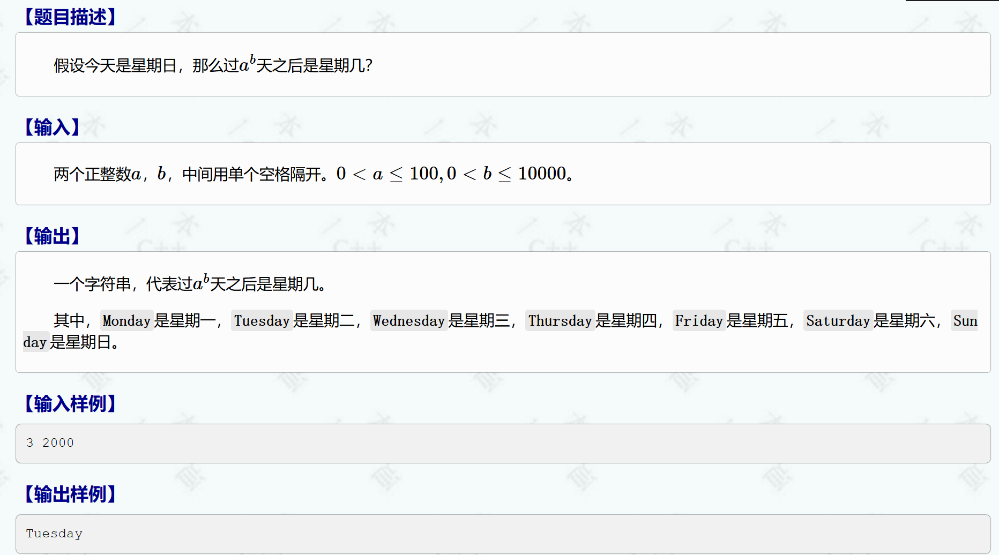
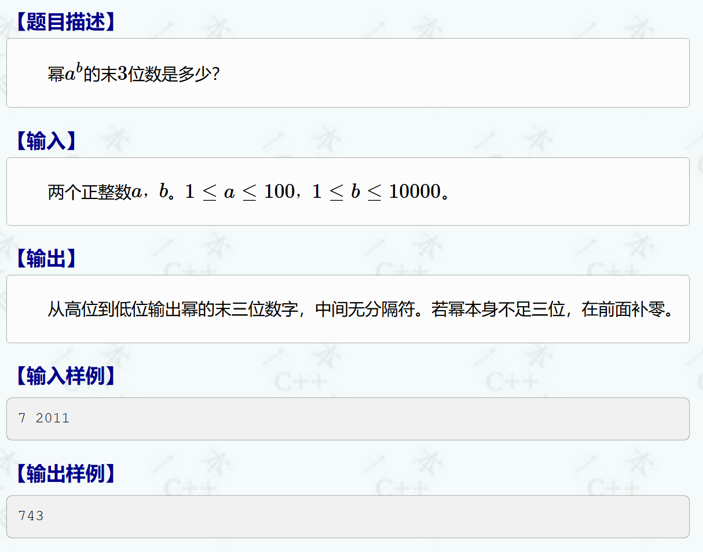
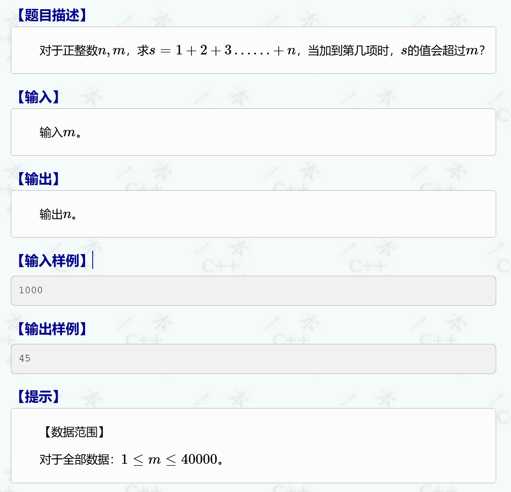
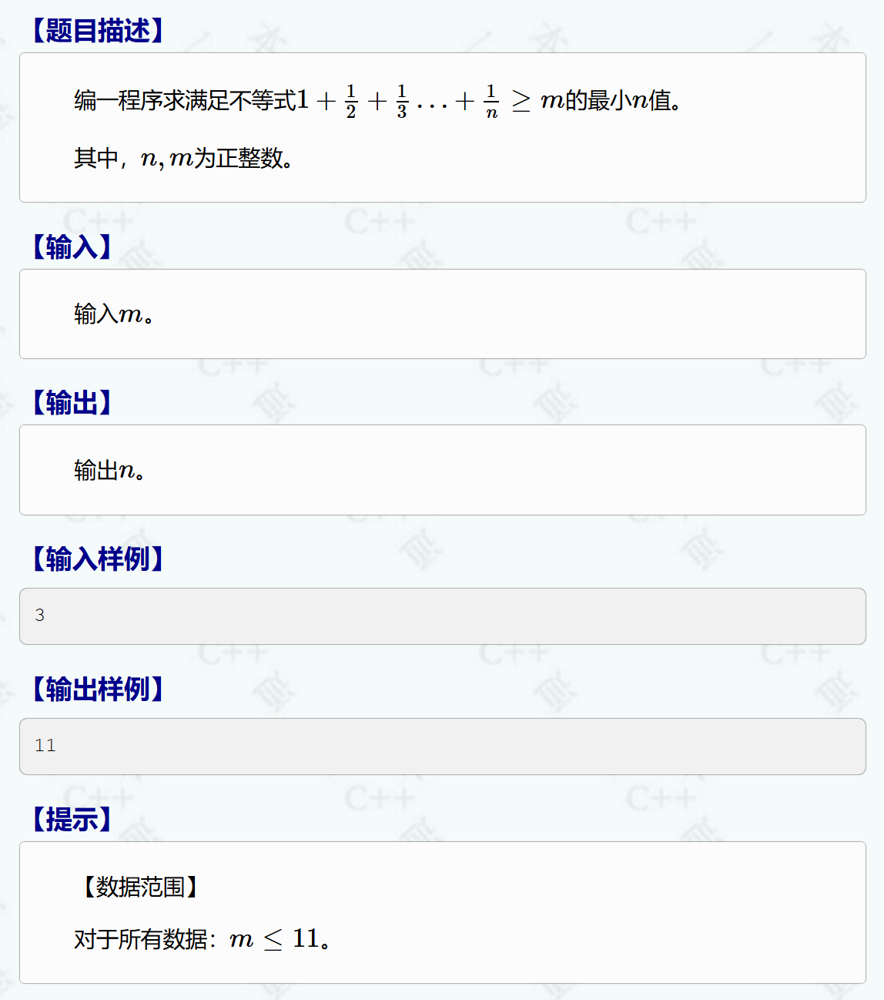
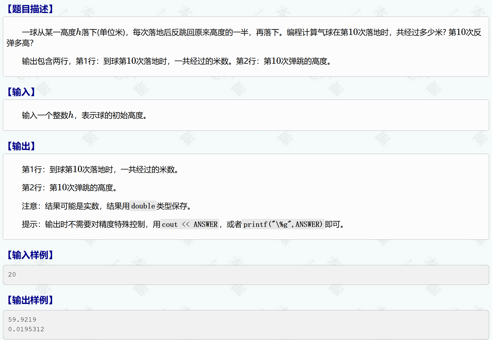
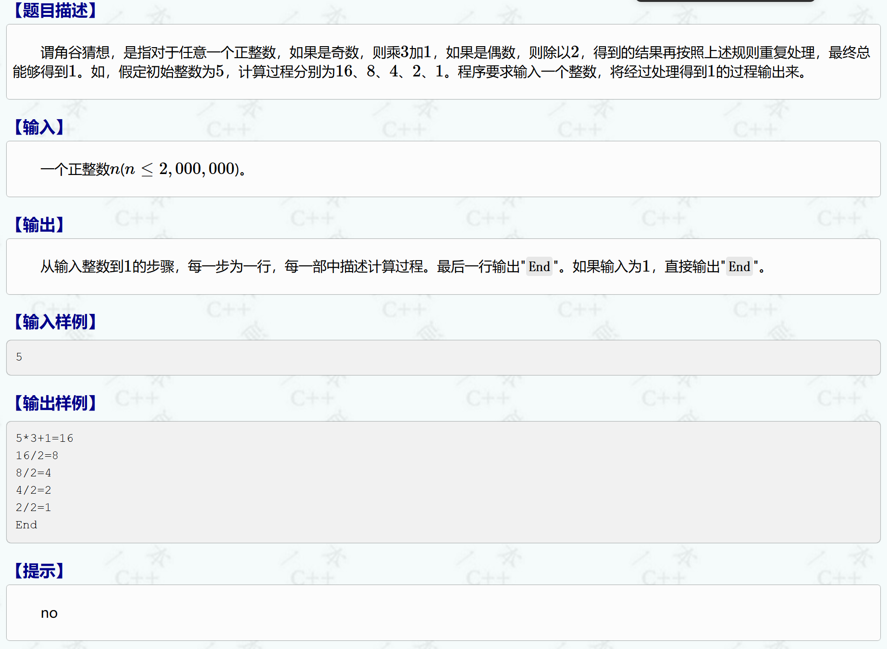
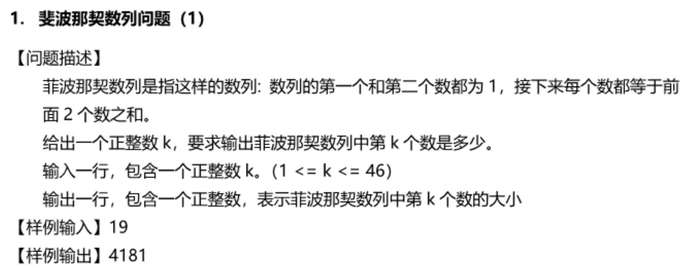
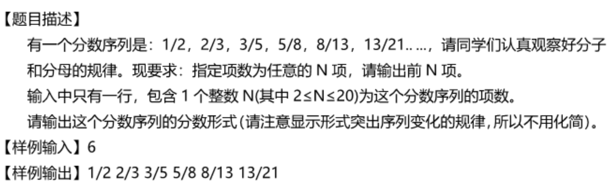
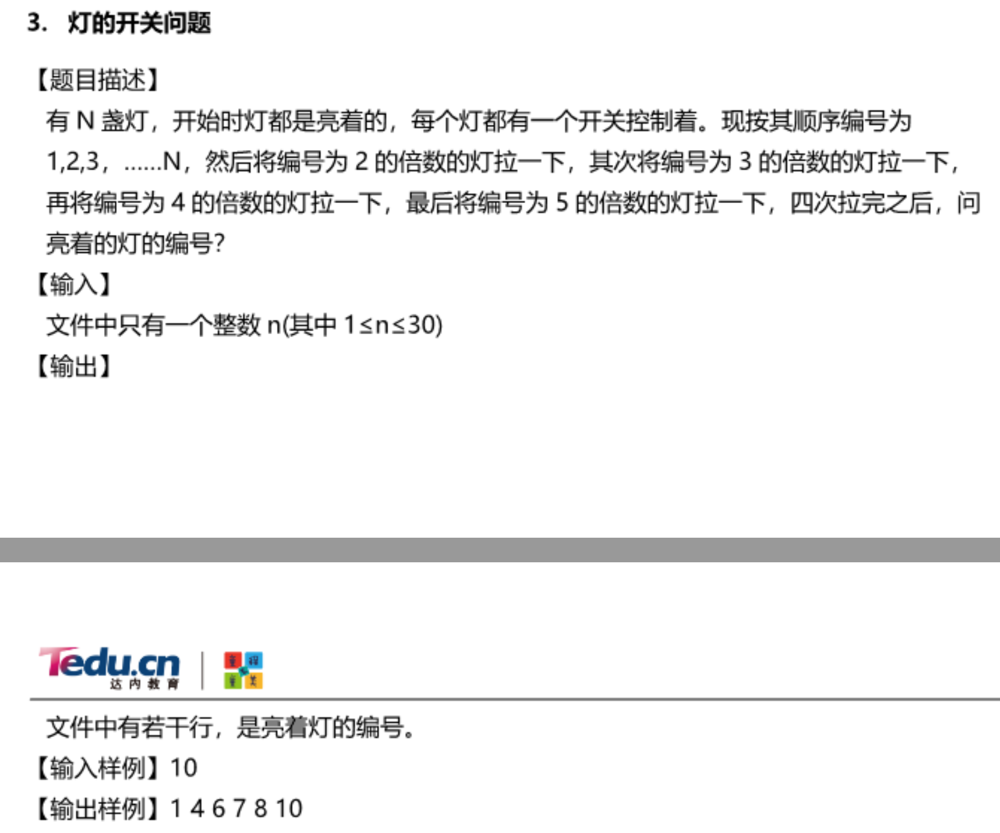
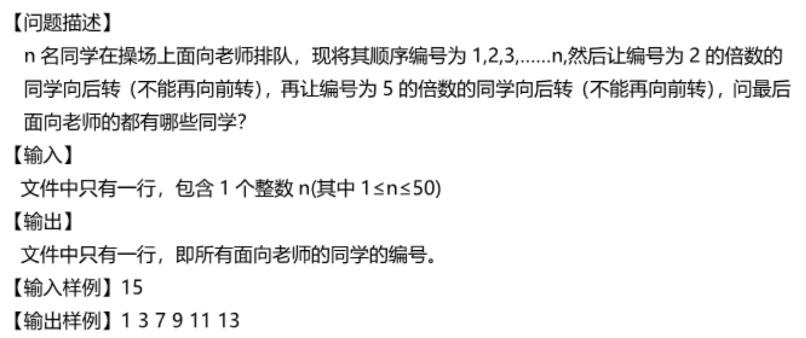

### 一、作业讲评

#### 1. 1083：计算星期几



```C++
#include <bits/stdc++.h>
using namespace std;
int main() {
	int a, b, day = 1;
	// a = 3  b = 2000
	cin >> a >> b;
	for (int i = 1; i <= b; i++)
	{
		day *= a;
		day %= 7;
	}
	// 判断0 ~ 6  周天 ~周六
	cout << day;
	return 0;
}

```


#### 2. 1084：幂的末尾



8^3 = 512             % 100 = 12         12 * 8 = 96

8^4 = 4096           % 100 = 96         96 * 8 = 768

8^5 = 32768         % 100 = 68

```C++
#include <bits/stdc++.h>
using namespace std;
int main() {
	// 7  2011
	int a, b, num = 1;
	cin >> a >> b;

	for (int i = 1; i <= b; i++)
	{
		num *= a;
		num %= 1000;
	}
	if (num < 10) // 个位
	{
		cout << "00";
	}
	else if (num < 100)
	{
		cout << "0";
	}
	cout << num;
	
	return 0;
}
```


#### 3. 2020：【例4.5】第几项



```C++
#include<iostream>
#include<iomanip>
using namespace std;
int main() {
	int m, n = 1 , s = 0;
	cin >> m;

	while (s <= m) {
		s += n;
		n++;
	}

	cout << n - 1;
	
	return 0;
}
```


#### 4. 2022：【例4.7】最小n值



```C++
#include <iostream>
using namespace std;
int main() {
	int m;
	cin >> m;
	double total = 0, n = 0;
	
	while (total < m)
	{
		n++;
		total += 1 / n;
	}
	cout << n;
	return 0;
}
```


#### 5. 1085：球弹跳高度的计算



```C++
#include <iostream>
using namespace std;
int main() {
	double h, n = 1, total_height;
	cin >> h;
	total_height = h * 2;
	while (n <= 10 - 2)
	{
		h /= 2;
		total_height += h;
		n++;
	}
	cout << total_height << endl << h / 4;
	return 0;
}
```


#### 6. 1086：角谷猜想



```C++
#include <bits/stdc++.h>
using namespace std;
int main() {

	int n;
	cin >> n;
	while (n != 1)
	{
		if (n % 2 == 1)
		{
			cout << n << "*3+1=" << n * 3 + 1 << endl;
			n = n * 3 + 1;
		}
		else {
			cout << n << "/2=" << n / 2 << endl;
			n /= 2;
		}
	}
	cout << "End";
	
	return 0;
}
```


### 二、课堂练习

#### 1. 斐波那契数列



```C++
#include <bits/stdc++.h>
using namespace std;
int main() {

	int k, arr[46] = {1, 1};
	cin >> k;
	for (int i = 2; i < k; i++)
	{
		arr[i] = arr[i - 1] + arr[i - 2];
	}
	
	cout << arr[k - 1];
	
	return 0;
}

```


#### 2. 斐波那契数列变种



```C++
#include <bits/stdc++.h>
using namespace std;
int main() {

	int k, arr[46] = {1, 1};
	cin >> k;
	for (int i = 2; i < k + 2; i++)
	{
		arr[i] = arr[i - 1] + arr[i - 2];
	}
	
	for (int i = 0; i < k; i++)
	{
		cout << arr[i + 1] << "/" << arr[i + 2] << " ";
	}
	
	return 0;
}

```


#### 3. 开关灯



```C++
// 做法1  true false判断
#include <bits/stdc++.h>
using namespace std;
int main() {

	int n;
	bool arr[31] = {};   // true 开灯  false 关灯
	cin >> n;
	for (int i = 1; i <= n; i++)
	{
		arr[i] = true;  // 默认全部开灯

		if (i % 2 == 0) arr[i] = !arr[i];
		if (i % 3 == 0) arr[i] = !arr[i];
		if (i % 4 == 0) arr[i] = !arr[i];
		if (i % 5 == 0) arr[i] = !arr[i];

		if (arr[i]) cout << i << " ";
	}
	
	


	return 0;
}

```

```C++
// 做法2   1 0 判断
#include <bits/stdc++.h>
using namespace std;
int main() {

	int n;
	int arr[31] = {};   // 1 开灯  0 关灯
	cin >> n;
	for (int i = 1; i <= n; i++)
	{
		arr[i] = 1;  // 默认全部开灯

		if (i % 2 == 0) arr[i] = 1 - arr[i];
		if (i % 3 == 0) arr[i] = 1 - arr[i];
		if (i % 4 == 0) arr[i] = 1 - arr[i];
		if (i % 5 == 0) arr[i] = 1 - arr[i];

		if (arr[i]) cout << i << " ";
	}
	return 0;
}

```

```C++
// 做法3   奇偶数判断
#include <bits/stdc++.h>
using namespace std;
int main() {

	int n;
	int arr[31] = {};   // 奇数 开灯  偶数 关灯
	cin >> n;
	for (int i = 1; i <= n; i++)
	{
		arr[i] = 1;  // 默认全部开灯

		if (i % 2 == 0) arr[i] += 1;
		if (i % 3 == 0) arr[i] += 1;
		if (i % 4 == 0) arr[i] += 1;
		if (i % 5 == 0) arr[i] += 1;

		if (arr[i] % 2 == 1) cout << i << " ";
	}

	return 0;
}

```


#### 4. 操场排队



```C++
#include <bits/stdc++.h>   // 引入头文件
using namespace std;
int main() {

	int n;
	int arr[51] = {};  
	cin >> n;
	for (int i = 1; i <= n; i++)
	{
		arr[i] = 1;  // 默认全部面向老师  0是背对老师

		// 做法1
		// if (i % 2 == 0) arr[i] = 1 - arr[i];
		// else if (i % 5 == 0) arr[i] = 1 - arr[i];

		// 做法2
		if(i % 2 == 0 || i % 5 == 0) arr[i] = 0;

		if (arr[i]) cout << i << " ";
	}
	return 0;
}
```


### 三、本节课作业

一本通 一维数组  2034、2035、2036、1109

### 四、课堂表现

|  姓名  | 作业 | 默写 | 课间 | 斐波那契 | 斐波那契变种 | 课间 | 开关灯 | 操场排队 |
| :----: | :--: | :--: | :--: | -------- | ------------ | :--: | ------ | -------- |
| 陈应豪 |  1   |  1   |  1   | 1        | 1            |  1   | 1      | 1        |
| 张睿恩 |  1   |  1   |      | 1        | 1            |  -1  | 0.5    | 0.5      |
| 卢笃严 |  1   |  1   |      | 1        | 1            |      | 0.5    | 1        |
| 方天宇 |  1   |  1   |      | 1        | 1            |      | 0.5    | 1        |
| 康书铭 |  1   |  1   |  -1  | 1        | 1            |  -1  | 1      | 1        |
| 黄彦文 |  1   |  1   |  -1  | 1        | 0.5          |  -1  | 0.5    | 1        |
| 张俊杰 |  1   |  1   |  -1  | 1        | 0.5          |  -1  | 0.5    | 1        |
| 黄思雅 |  1   |  1   |  -1  | 1        | 1            |      | 1      | 1        |
|  念溪  |  1   |  1   |      | 0.5      | 0.5          | 0.5  | 0.5    | 0.5      |

