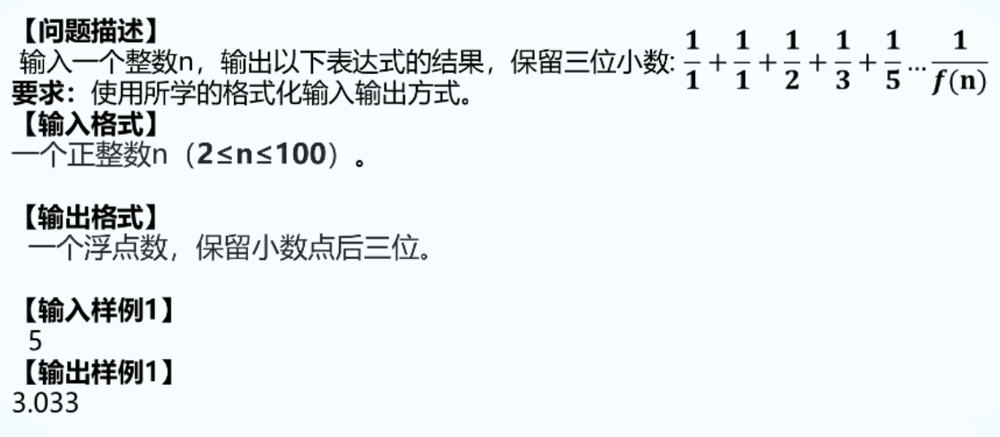

### 1. 计算圆周率

```C++
#include <bits/stdc++.h>
using namespace std;
int main() {
	double pi = 0;
	int d = 4; // 分子
	int n = 1; // 分母
	for (int i = 0; i < 500000; i++)
	{
		if (i % 2 == 0)
		{
			pi += double(d) / n;
		}
		else {
			pi -= double(d) / n;
		}
		n += 2;
	}
	cout <<fixed << setprecision(6) << pi;
	return 0;
}
```

### 2. 计算分数表达式



```C++
// 做法1
#include<bits/stdc++.h>
using namespace std;
int main() {
	
	int cnt, a = 1, b = 1, c = 0;
	double sum = 2;
	scanf_s("%d", &cnt);

	for (int i = 3; i <= cnt; i++)
	{
		c = a + b;
		sum = sum + (1.0 / c);
		a = b;
		b = c;
	}
	// cout << fixed << setprecision(3) << sum;
	printf("%.3f", sum);

	return 0;
}
```

```C++
// 做法2
#include<bits/stdc++.h>
using namespace std;
int main() {
	
	// 数组
	int a[101] = {1, 1, 1}, n;
	double sum = 0;
	cin >> n;
	for (int i = 3; i <= n; i++)
	{
		a[i] = a[i - 1] + a[i - 2];
	}
	for (int i = 1; i <= n; i++)
	{
		sum += 1.0 / a[i];
	}
	cout << fixed << setprecision(3) << sum;


	return 0;
}
```


### 3. 偶数均值


```C++
#include<bits/stdc++.h>
using namespace std;
int main() {
	
	int n, a[1001], sum = 0,  count = 0;
	double avg = 0;
	cin >> n;
	for (int i = 0; i < n; i++)
	{
		cin >> a[i];
		if (a[i] % 10 == 2)
		{
			sum += a[i];
			count++;
		}
	}
	avg = (double)sum / count;
	printf("%.3f\n", avg);

	for (int i = 0; i < n; i++)
	{
		if (a[i] < avg)
		{
			cout << a[i] << " ";
		}
	}

	return 0;
}
```

### 4. 鸡尾酒疗法


```C++
#include<bits/stdc++.h>
using namespace std;
int main() {
	
	int n, j_total, j_s;
	cin >> n;
	cin >> j_total >> j_s;
	double j_rate = (double)j_s / j_total;
	string s[100];

	for (int i = 0; i < n - 1; i++)
	{
		int total, success;
		cin >> total >> success;
		double rate = (double)success / total;
		if (rate - j_rate > 0.05)
		{
			s[i] = "better";
		}
		else if (j_rate - rate > 0.05) {
			s[i] =  "worse";
		}
		else {
			s[i] =  "same";
		}
	}

	for (int i = 0; i < n -1; i++)
	{
		cout << s[i] << endl;
	}


	return 0;
}
```
