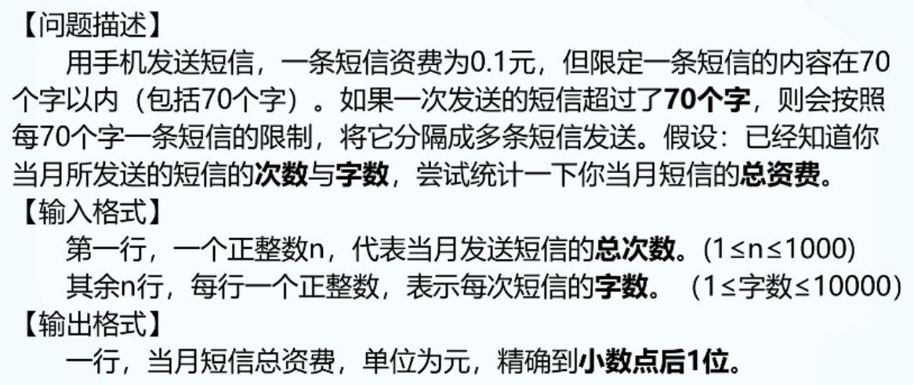

### 短信计费




```C++
// 做法1
#include <bits/stdc++.h>
using namespace std;

int main() {
	
	int n;
	double total_money = 0;
	cin >> n;
	for (int i = 0; i < n; i++)
	{
		int m;
		cin >> m;
		total_money += ((m / 70) + 1) * 0.1;
        // total_money += ceil(m / 70.0) * 0.1;   第二种做法，向上取整
	}
	cout << total_money;
	
	return 0;
}
```

```C++
// 做法2
#include<bits/stdc++.h>
using namespace std;
int main() {
	
	int n;
	double money = 0;
	cin >> n;
	for (int i = 0; i < n; i++)
	{
		int count;
		cin >> count;
		money += ceil(count / 70.0) * 0.1;
	}

	cout << money;
	return 0;
}
```


### 优质奶牛


```C++
#include<bits/stdc++.h>
using namespace std;
int main() {
	
	int n, count = 0;
	double a[100], total = 0, avg = 0;
	cin >> n;
	for (int i = 0; i < n; i++)
	{
		cin >> a[i];
		total += a[i];
	}
	avg = total / n;
	cout << fixed << setprecision(2) << avg << endl;
	for (int i = 0; i < n; i++)
	{
		if (a[i] > avg)
		{
			count++;
		}
	}
	cout << count;

	return 0;
}
```


### 含k的个数


```C++
#include<bits/stdc++.h>
using namespace std;

int main() {
	int num, k, count = 0;
	cin >> num >> k;
	while (num != 0) {
		if (num % 10 == k)
		{
			count++;
		}
		num /= 10;
	}

	cout << count;
	return 0;
}
```

### 回文数


```C++
// 做法1
#include <iostream>
using namespace std;
int main(){
	int n;
	cin >> n;
	int a[1000] = {0};
	for(int i=0; i<n; i++){
		cin>>a[i];
	}
	int start=0, end=n-1;
	bool flag=1;
	while(start<end){
		if(a[start]!=a[end]){
			flag=0;
			break;
		}
		start++;
		end--;
	}
	if(flag) cout << "YES";
	else cout << "NO";
	return 0;
}

```

```C++
// 做法2
#include <iostream>
using namespace std;
int main() {
	int n, a[1000];
	cin >> n;
	
	for (int i = 0; i < n; i++)
	{
		cin >> a[i];
	}

	int start = 0, end = n - 1;
	bool flag = true;
	for (int i = 0; i < n / 2; i++)
	{
		if (a[start] != a[end])
		{
			flag = false;
			break;
		}
		start++;
		end--;
	}
	if (flag)
	{
		printf("yes");
	}
	else {
		printf("no");
	}

	return 0;
}

```

```C++
// 做法3
#include <bits/stdc++.h>
using namespace std;

int main() {
	int n;
	cin >> n;
	int a[1000];
	bool flag = true;  // true 是回文数  false 不是回文数
	for (int i = 0; i < n; i++)
	{
		cin >> a[i];
	}
	for (int i = 0; i < n / 2; i++)
	{
		if (a[i] != a[n - i - 1])
		{
			flag = false;
			break;
		}
	}

	if (flag)
	{
		cout << "yes";
	}
	else {
		cout << "no";
	}
	
	return 0;
}
```


