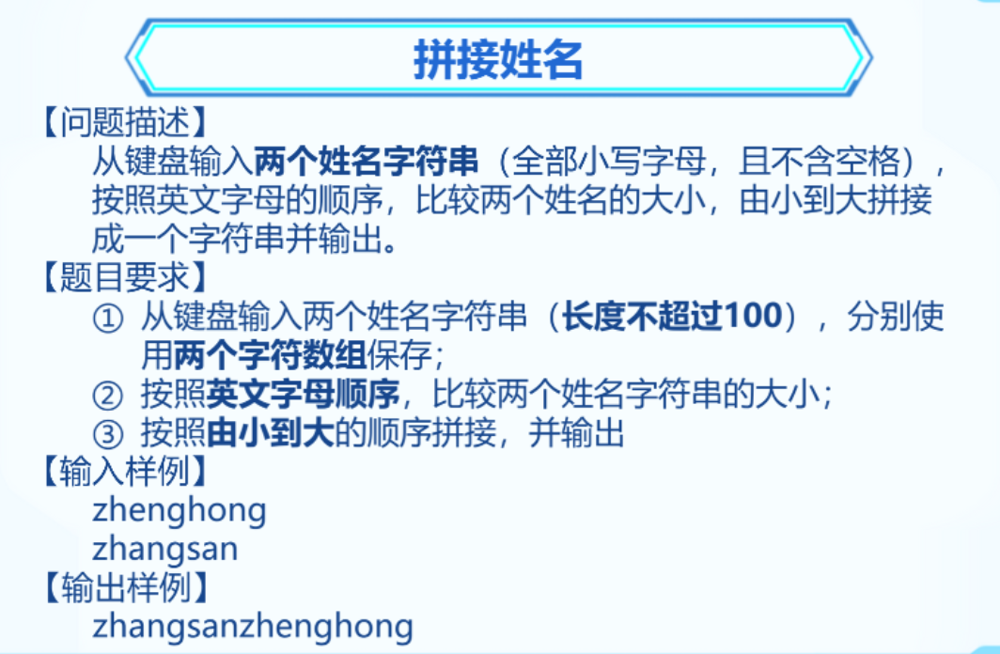
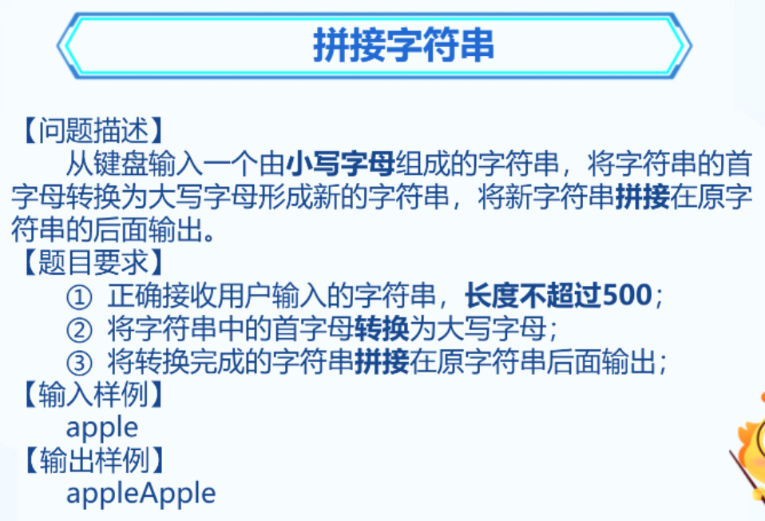
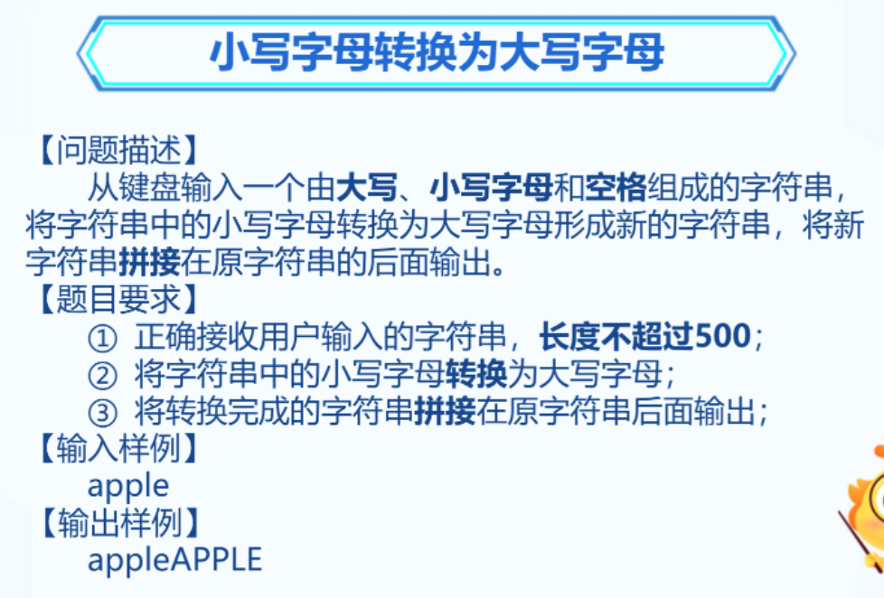
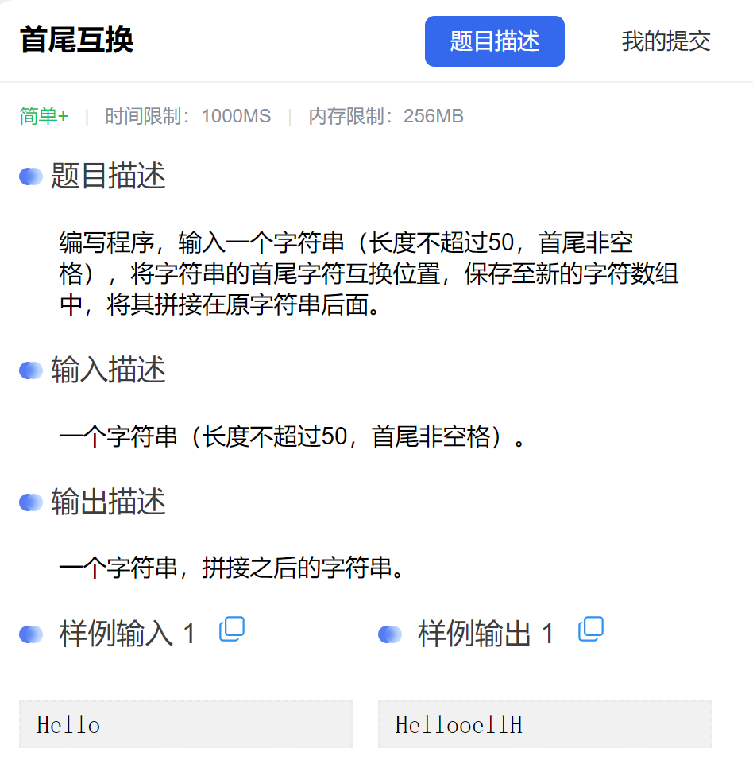
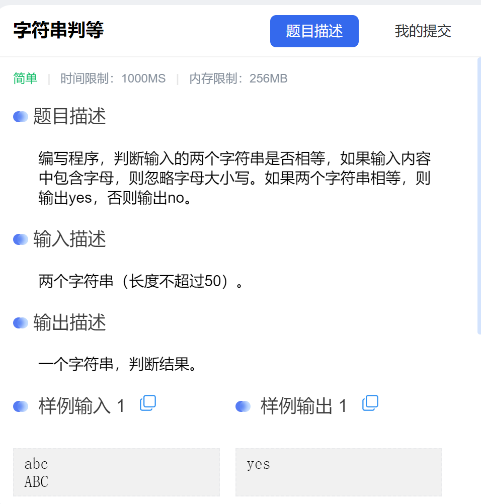

### 1. 拼接姓名



```C++
#include <bits/stdc++.h>
using namespace std;


int main() {
	char name1[201] = { 0 };
	char name2[201] = { 0 };
	cin >> name1 >> name2;
	if (strcmp(name1, name2) > 0)
	{
		strcat_s(name2, name1);
		cout << name2;
	}
	else {
		strcat_s(name1, name2);
		cout << name1;
	}


	return 0;
}
```


### 2. 拼接字符串



```C++
#include <bits/stdc++.h>
using namespace std;


int main() {
	
	char s1[501] = { 0 };
	char s2[501] = { 0 };
	cin >> s1;
	strcpy_s(s2, s1);
	s2[0] -= 32;
	strcat_s(s1, s2);
	cout << s1;
	return 0;
}
```


### 3. 小写转大写



```C++
#include <bits/stdc++.h>
using namespace std;


int main() {
	
	char s1[500] = { 0 };
	char s2[500] = { 0 };
	cin.getline(s1, 501);
	strcpy_s(s2, s1);
	// 这里进行判断
	for (int i = 0; i < strlen(s2); i++)
	{
		// s2[i] -= 32; // 错误的
		if (s2[i] >= 'a' && s2[i] <= 'z')
		{
			s2[i] -= 32;
		}
	}
	strcat_s(s1, s2);
	cout << s1;
	return 0;
}
```


### 4. 首尾互换



```C++
#include <bits/stdc++.h>
using namespace std;


int main() {
	
	char s1[50] = { 0 };
	char s2[50] = { 0 };
	char temp;
	cin.getline(s1, 51);
	strcpy_s(s2, s1);
	temp = s2[0];
	s2[0] = s2[strlen(s2) - 1];
	s2[strlen(s2) - 1] = temp;
	strcat_s(s1, s2);
	cout << s1;
	
	return 0;
}
```


### 5. 字符串判等



```C++
#include <bits/stdc++.h>
using namespace std;


int main() {

	char s1[50] = { 0 }, s2[50] = { 0 };
	cin.getline(s1, 50);
	cin.getline(s2, 50);

	if (strlen(s1) != strlen(s2))
	{
		cout << "no";
		return 0;
	}

	bool flag = true;
	for (int i = 0; i < strlen(s1); i++)
	{
		if (s1[i] + 32 == s2[i] || s1[i] - 32 == s2[i] || s1[i] == s2[i])
		{
			continue;
		}
		else {
			flag = false;
			break;
		}
	}
	if (flag)
	{
		cout << "yes";
	}
	else {
		cout << "no";
	}

	return 0;
}
```

