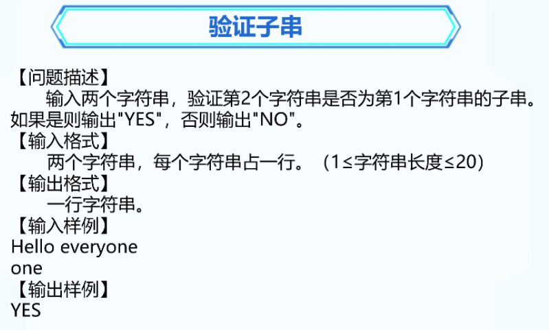

### 1. 替换空格


```C++
#include <bits/stdc++.h>
using namespace std;

int main() {
	string s;
	getline(cin, s);
	for (int i = 0; i < s.length(); i++)
	{
		if (s[i] == ' ')
		{
			s[i] = ',';
		}
	}
	cout << s;

	return 0;
}
```


### 2. 统计逗号


```C++
// 写法1
#include <bits/stdc++.h>
using namespace std;

int main() {
	string s;
	getline(cin, s);
	int total = 0;
	for (int i = 0; i < s.size(); i++)
	{
		if (s[i] == ',')
		{
			total++;
		}
	}
	cout << total;

	return 0;
}
```

```C++
// 写法2
#include <bits/stdc++.h>
using namespace std;

int main() {
	string s;
	getline(cin, s);
	int total = 0;
	for (char letter : s)
	{
		if (letter == ',')
		{
			total++;
		}
	}
	cout << total;

	return 0;
}
```


### 3. 验证子串



```C++
#include <bits/stdc++.h>
using namespace std;

int main() {
	string s1, s2;
	getline(cin, s1);
	getline(cin, s2);
	int n = s1.find(s2);
	if (n != -1)
	{
		cout << "yes";
	}
	else {
		cout << "no";
	}
	
	return 0;
}
```


### 4. 查找单词


```C++
#include <bits/stdc++.h>
using namespace std;

int main() {
	string s1;
	getline(cin, s1);
	int f1 = s1.find("ing");
	int f2 = s1.find("er");
	int f3 = s1.find("ly");

	if (f1 != -1)
	{
		cout << "ing " << f1 << endl;
	}
	if (f2 != -1)
	{
		cout << "er " << f2 << endl;
	}
	if (f3 != -1)
	{
		cout << "ly " << f3 << endl;
	}
	
	return 0;
}
```


### 5. 整理药名


```C++
#include <bits/stdc++.h>
using namespace std;

int main() {
	string s1;
	getline(cin, s1);
	if (s1[0] >= 'a' && s1[0] <='z')
	{
		s1[0] -= 32;
	}
	for (int i = 1; i < s1.length(); i++)
	{
		if (s1[i] >= 'A' && s1[i] <= 'Z')
		{
			s1[i] += 32;
		}
	}
	cout << s1;
	
	return 0;
}
```


