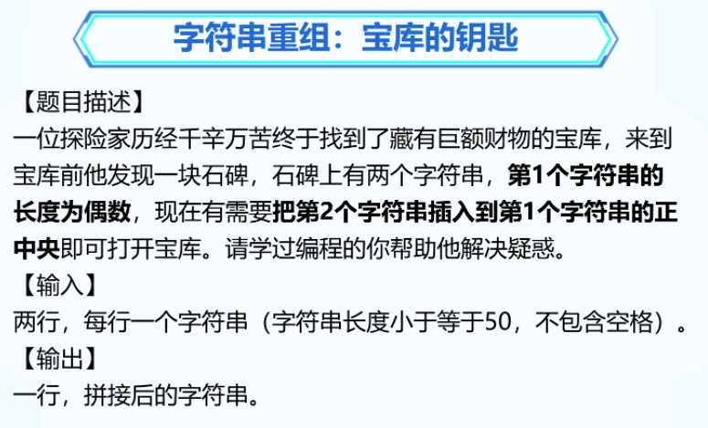
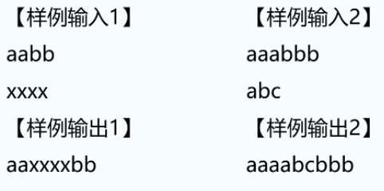
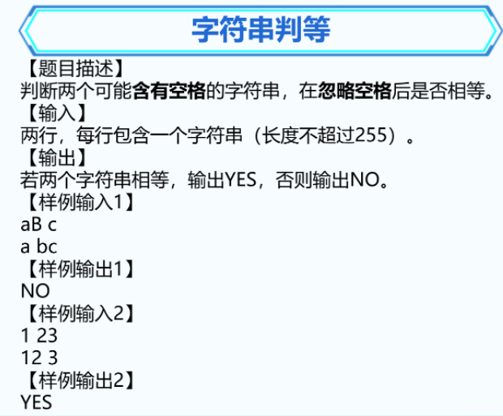
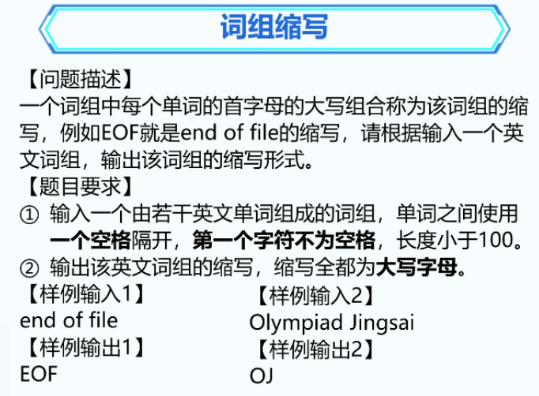
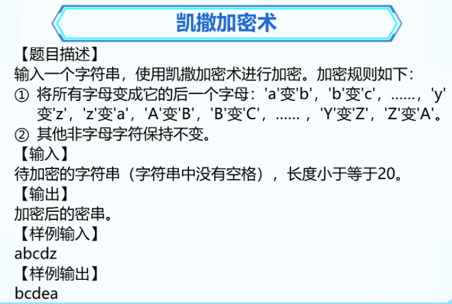
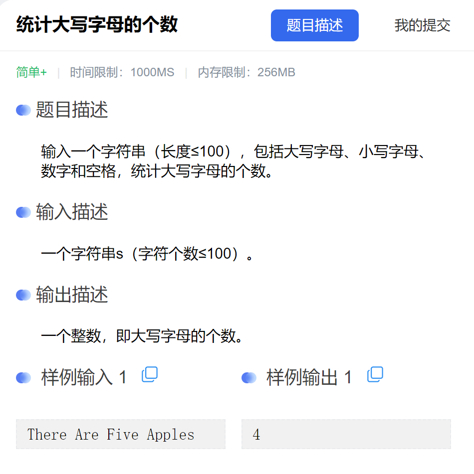

### 1. 宝库的钥匙





```C++
#include <bits/stdc++.h>
using namespace std;

int main() {
	string s1, s2;
	getline(cin, s1);  // aabb
	getline(cin, s2);  // xxxx

	// 输出aa
	for (int i = 0; i < s1.length() / 2; i++)
	{
		cout << s1[i];
	}
	// 输出xxxx
	cout << s2;

	// 输出bb
	for (int i = s1.length() / 2; i < s1.length(); i++)
	{
		cout << s1[i];
	}
	return 0;
}
```


### 2. 字符串判等



```C++
#include <bits/stdc++.h>
using namespace std;

int main() {
	string s1, s2, a, b;
	getline(cin, s1);
	getline(cin, s2);

	for (int i = 0; i < s1.length(); i++)
	{
		if (s1[i] == ' ')
		{
			continue;
		}
		a += s1[i];
	}
	for (int i = 0; i < s2.length(); i++)
	{
		if (s2[i] == ' ')
		{
			continue;
		}
		b += s2[i];
	}
	if (a == b)
	{
		cout << "YES";
	}
	else {
		cout << "NO";
	}
	return 0;
}
```


### 3. 判断回文串


```C++
// 做法1
#include <bits/stdc++.h>
using namespace std;

int main() {
	string s1;
	getline(cin, s1);  // 123321
	
	bool flag = true; // 如果是回文串 true   不是 false
	// 123
	for (int i = 0; i < s1.length() / 2; i++)
	{
		if (s1[i] == s1[s1.length() - 1 - i])
		{
			continue;
		}
		flag = false;
		break;
	}
	if (flag)
	{
		cout << "Yes";
	}
	else {
		cout << "No";
	}


	return 0;
}
```

```C++
// 做法2
#include <bits/stdc++.h>
using namespace std;

int main() {
	string s1 , s2;
	getline(cin, s1);  // 123321
	
	for (int i = s1.length() - 1; i >= 0; i--)
	{
		s2 += s1[i];
	}
	if (s1 == s2)
	{
		cout << "yes";
	}
	else {
		cout << "no";
	}

	return 0;
}
```


### 4. 词组缩写



```C++
#include <bits/stdc++.h>
using namespace std;

int main() {
	string s1, s2;
	getline(cin, s1);  // end of file
	s2 += s1[0];
	for (int i = 1; i < s1.length(); i++)
	{
		if (s1[i] == ' ')
		{
			s2 += s1[i + 1];
		}
	}
	for (int i = 0; i < s2.length(); i++)
	{
		if (s2[i] >= 'a' && s2[i] <= 'z')
		{
			s2[i] -= 32;
		}
	}
	cout << s2;

	return 0;
}
```


### 6. 凯撒加密术



```C++
#include <bits/stdc++.h>
using namespace std;

int main() {
	string s1;
	getline(cin, s1);
	
	for (int i = 0; i < s1.length(); i++)
	{
		if ((s1[i] >= 'a' && s1[i] <= 'z') || (s1[i] >= 'A' && s1[i] <= 'Z'))
		{
			if (s1[i] == 'z')
			{
				s1[i] = 'a';
				continue;
			}
			if (s1[i] == 'Z')
			{
				s1[i] = 'A';
				continue;
			}
			s1[i]++;
		}
	}
	cout << s1;

	return 0;
}
```


### 7. 统计大写字母的个数



```C++
#include <bits/stdc++.h>
using namespace std;

int main() {
	string s1;
	getline(cin, s1);
	int count = 0;
	for (int i = 0; i < s1.length(); i++)
	{
		if (s1[i] >= 'A' && s1[i] <= 'Z')
		{
			count++;
		}
	}
	cout << count;
	
	return 0;
}
```

