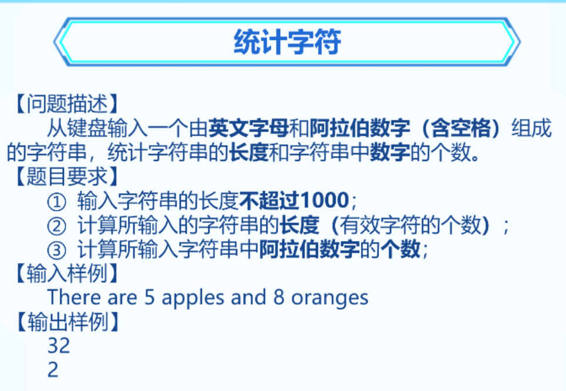
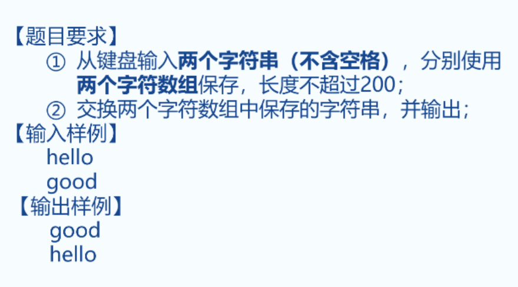
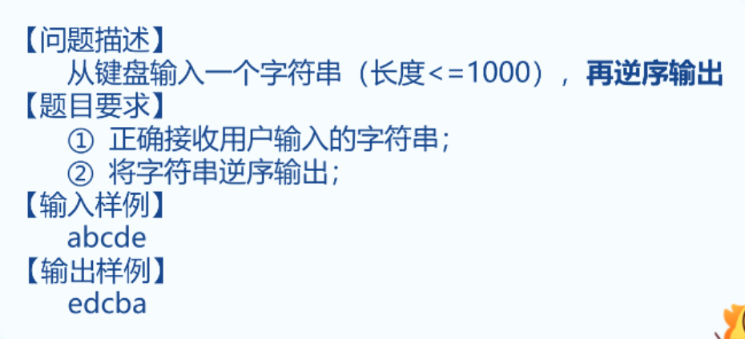

### 1. 统计字符



```C++
#include <iostream>
using namespace std;
int main() {
	char s[1001] = {};
	cin.getline(s, 1001);
	int i = 0, c = 0;
	while (s[i] != 0) {
		if (s[i] >= '0' && s[i] <= '9') c++;
		i++;
	}
	cout << i << endl << c;

	return 0;
	
}

```


### 2.根据空格分割字符串

皓羽、少茞、陈瀚、陈炜瀚

【问题描述】
从键盘输入一个字符串，字符串中包含多个空格，根据空格将字符串分割为多个字符串

【题目要求】

1. 输出字符串的长度不超过1000

【输入样例】

```C++
abc def ccc
```

【输出样例】
```C++
abc
def
ccc
```

```C++
// 做法1
#include <iostream>
using namespace std;
int main() {
	char a[1000] = {}, b[1000] = {};
	cin.getline(a, 1001);

	int i = 0, j = 0;
	while (a[i] != 0) {
		if (a[i] == ' ')
		{
			cout << b << endl;
			for (int z = 0; z <= j; z++) b[z] = 0; // 清空b数组
			i++;
			j = 0;
			continue;
		}
		b[j] = a[i];
		i++;
		j++;
	}
	cout << b;

	return 0;
}
```


```C++
// 做法2
char s[1000] = {}, s1[1000] = {}, s2[1000] = {};
int x = 0;
cin.getline(s, 1000);

for (int i = 0; i < 1000; i++)
{
	x++;
	if (s[i] == ' ')
	{
		break;
	}
	s1[i] = s[i];
}
int s2_i = 0;
for (int i = x; i < 1000; i++)
{
	
	if (s[i] == 0)
	{
		break;
	}
	s2[s2_i] = s[i];
	s2_i++;
}

cout << s1 << endl << s2;

```


### 3. 交换字符串



```C++
#include <bits/stdc++.h>
using namespace std;


int main() {
	char s1[201] = { 0 };
	char s2[201] = { 0 };
	char temp[201] = { 0 };
	cin >> s1 >> s2;

	strcpy_s(temp, s1);  // temp = a;
	strcpy_s(s1, s2);       // a = b;
	strcpy_s(s2, temp);  // b = temp;

	cout << s1 << endl << s2;

	return 0;
}
```


### 4. 字符串的逆序



```C++
#include <bits/stdc++.h>
using namespace std;


int main() {
	char s1[1000] = { 0 };
	cin.getline(s1, 1001);


	for (int i = strlen(s1) - 1; i >= 0; i--)
	{
		cout << s1[i];
	}

	return 0;
}
```
