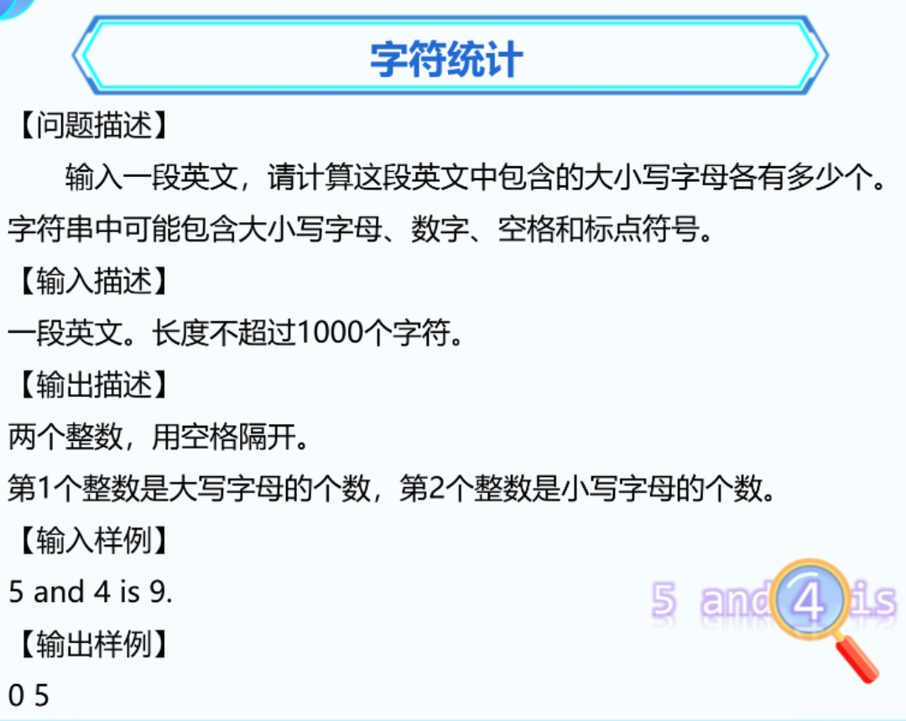

| 姓名                                                         | 1. 数字游戏 | 2.座右铭 | 3.字符统计 | 4. 单词过滤 | 5. 最长的单词 | 6. 分数最高的同学 |
| ------------------------------------------------------------ | ----------- | -------- | ---------- | ----------- | ------------- | ----------------- |
| 吴鸿非                                                       | 50          | 50       | 50         | 50          | 50            | 50                |
| 吴兆霖                                                       | 25          | 25       | 50         | 50          | 50            | 50                |
| xxxxxxxxxx #include <bits/stdc++.h>using namespace std;​​int main() {    char s1[1000] = { 0 };    cin.getline(s1, 1001);​​    for (int i = strlen(s1) - 1; i >= 0; i--)    {        cout << s1[i];    }​    return 0;}C++ | 25          | 25       | 25         | 50          | 50            | 50                |
| 丁少茞                                                       | 25          | 25       | 25         | 50          | 50            | 50                |
| 陈祺昊                                                       | 50          | 50       | 50         | 50          | 50            | 50                |
| 郑子洹                                                       | 50          | 50       | 50         | 50          | 50            | 50                |
| 陈智杰                                                       | 50          | 25       | 50         | 50          | 50            | 50                |
| 陈瀚                                                         | 25          | 25       | 25         | 50          | 50            | 50                |


### 1. 数字游戏


```C++
#include <bits/stdc++.h>   
using namespace std;
int main() {

	string s;
	cin >> s;
	int sum = 0;
	for (int i = 0; i < s.length(); i++)
	{
		if (s[i] == '1')
		{
			sum++;
		}
	}
	cout << sum;

	return 0;
}
```


### 2. 座右铭


```C++
#include <bits/stdc++.h>   // 引入头文件
using namespace std;
int main() {
	// 字符数组
	string s1;
	getline(cin, s1);
	int sum = 0; // 统计空格的个数
	for (int i = 0; i < s1.length(); i++)
	{
		if (s1[i] == ' ')
		{
			sum++;
		}
	}
	cout << s1.length() - sum;

	return 0;
}
```

```C++
#include <bits/stdc++.h>   // 引入头文件
using namespace std;
int main() {
	// 字符数组
	string s1;
	getline(cin, s1);
	int sum = 0; // 统计非空格的个数
	for (int i = 0; i < s1.length(); i++)
	{
		if (s1[i] != ' ')
		{
			sum++;
		}
	}
	cout << sum;

	return 0;
}

```


### 3. 字符统计



```C++
#include <bits/stdc++.h>   
using namespace std;
int main() {

	string s;
	getline(cin, s);
	int max_a = 0, min_a = 0;
	for (int i = 0; i < s.length(); i++)
	{
		if (s[i] >= 'a' && s[i] <= 'z')
		{
			min_a++;
		}
		else if (s[i] >= 'A' && s[i] <= 'Z')
		{
			max_a++;
		}
	}
	cout << max_a << " " << min_a;

	return 0;
}

```


### 4. 单词过滤


```C++
#include <bits/stdc++.h>   // 引入头文件
using namespace std;
int main() {
	int n;  // 3
	cin >> n;
	
	for (int i = 0; i < n; i++)
	{
		string s1;
		cin >> s1;
		if (s1.find("tr") == -1)
		{
			cout << s1 << " ";
		}
	}
	
	
	return 0;
}

```


### 5. 最长的单词


```C++
int max_length = 0; // 最长的长度
string max_a; // 最长长度的字符串
for (int i = 0; i < n; i++)
{
	string s;   // 把每个单词都输入进来判断
	cin >> s;
	if (s.length() > max_length)
	{
		// 最长长度 = 当前的长度
		max_length = s.length();
		// 最长长度的字符串 = 当前的字符串
		max_a = s;
	}
}
cout << max_a;
	
```


### 6. 分数最高的同学


 

```C++
#include <bits/stdc++.h>   
using namespace std;
int main() {

	int n;  // 5
	cin >> n;
	int max_score = 0;
	string max_name;
	for (int i = 0; i < n; i++)
	{
		string name;
		int score;
		cin >> name >> score;
		if (score > max_score)
		{
			// 最高分替换为当前分数
			max_score = score;
			// 最高分同学替换为当前同学
			max_name = name;
		}
	}

	cout << max_name;

	
	return 0;
}

```


### 下周考试

考试范围【12.15】  【12.22】  【12.29】  【1.5】

选择题（20）    10题

编程题（80）     4题   


| 不及格 |  60  |  70  |  80  |  90  | 100  |
| :----: | :--: | :--: | :--: | :--: | :--: |
| -1000  | 100  | 300  | 500  | 800  | 1000 |

