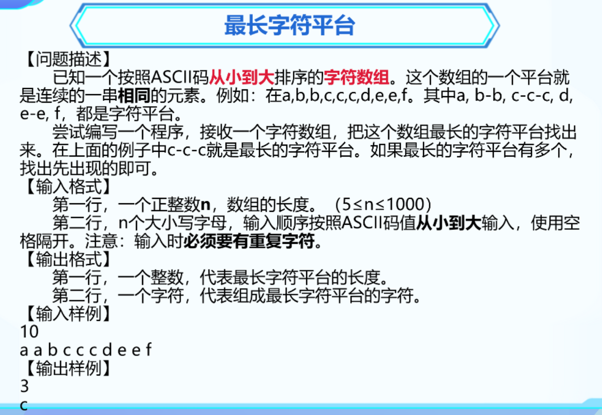
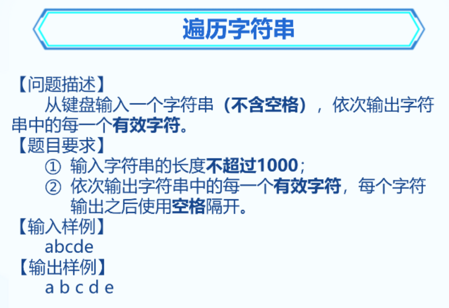
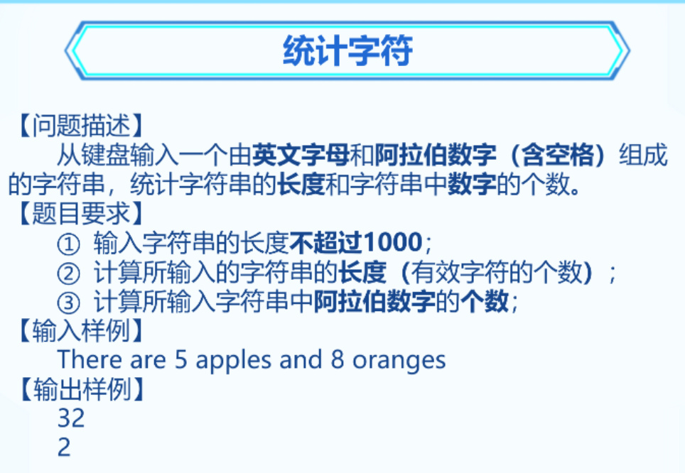

### 1. 作业


```C++
#include<bits/stdc++.h>
using namespace std;

int main() {
	int num, k, count = 0;
	cin >> num >> k;
	while (num != 0) {
		if (num % 10 == k)
		{
			count++;
		}
		num /= 10;
	}

	cout << count;
	return 0;
}
```

### 2. 回文数


```C++
#include <iostream>
using namespace std;
int main(){
	int n;
	cin >> n;
	int a[1000] = {0};
	for(int i=0; i<n; i++){
		cin>>a[i];
	}
	int start=0, end=n-1;
	bool flag=1;
	while(start<end){
		if(a[start]!=a[end]){
			flag=0;
			break;
		}
		start++;
		end--;
	}
	if(flag) cout << "YES";
	else cout << "NO";
	return 0;
}

```

```C++
#include <iostream>
using namespace std;
int main() {
	int n, a[1000];
	cin >> n;
	
	for (int i = 0; i < n; i++)
	{
		cin >> a[i];
	}

	int start = 0, end = n - 1;
	bool flag = true;
	for (int i = 0; i < n / 2; i++)
	{
		if (a[start] != a[end])
		{
			flag = false;
			break;
		}
		start++;
		end--;
	}
	if (flag)
	{
		printf("yes");
	}
	else {
		printf("no");
	}

	return 0;
}

```


### 3. 最长字符平台



```C++
#include <iostream>
using namespace std;
int main(){
	int n;
	cin>>n;
	char s[1000]={0};
	cin>>s[0];
	int max=1;//记录平台长度最大值
	int cnt=1;//记录组成最长平台的字符
	char c=s[0];	
	for(int i=1; i<n; i++){
		cin>>s[i];
		if(s[i]==s[i-1]) cnt++;
		else cnt=1;
		if(max<cnt){
			max=cnt;
			c=s[i];
		}
	}
	cout<<max<<endl<<c;
	return 0;
}

```


### 4. 遍历字符串



```C++
#include <bits/stdc++.h>
using namespace std;

int main() {
	char s[1000];
	cin >> s;
	int i = 0;
	while (s[i] != 0) {
		cout << s[i] << " ";
		i++;
	}
	return 0;
}
```


### 5. 统计字符



```C++
#include <iostream>
using namespace std;
int main() {
	char s[1001] = {};
	cin.getline(s, 1001);
	int i = 0, c = 0;
	while (s[i] != 0) {
		if (s[i] >= '0' && s[i] <= '9') c++;
		i++;
	}
	cout << i << endl << c;

	return 0;
	
}

```


### 6.根据空格分割字符串

【问题描述】
从键盘输入一个字符串，字符串中包含多个空格，根据空格将字符串分割为多个字符串

【题目要求】

1. 输出字符串的长度不超过1000

【输入样例】

```C++
abc def ccc
```

【输出样例】
```C++
abc
def
ccc
```

```C++
#include <iostream>
using namespace std;
int main() {
	char a[1000] = {}, b[1000] = {};
	cin.getline(a, 1001);

	int i = 0, j = 0;
	while (a[i] != 0) {
		if (a[i] == ' ')
		{
			cout << b << endl;
			for (int z = 0; z <= j; z++) b[z] = 0; // 清空b数组
			i++;
			j = 0;
			continue;
		}
		b[j] = a[i];
		i++;
		j++;
	}
	cout << b;

	return 0;
}
```
