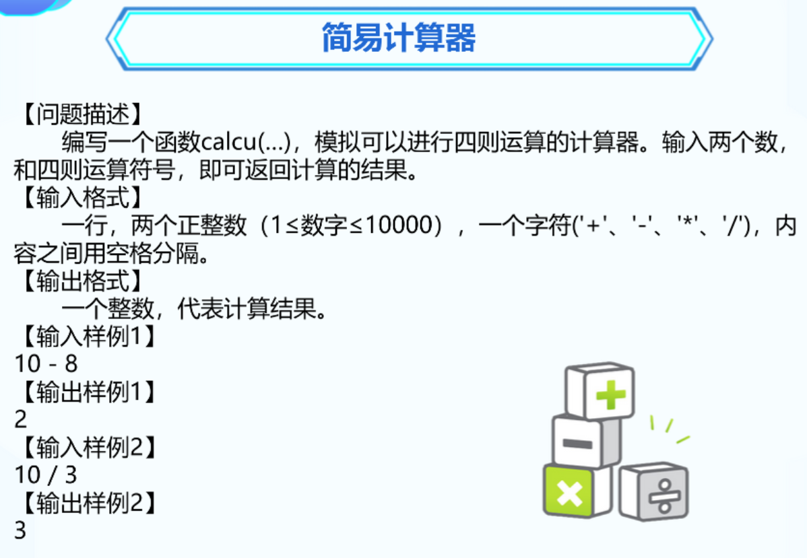
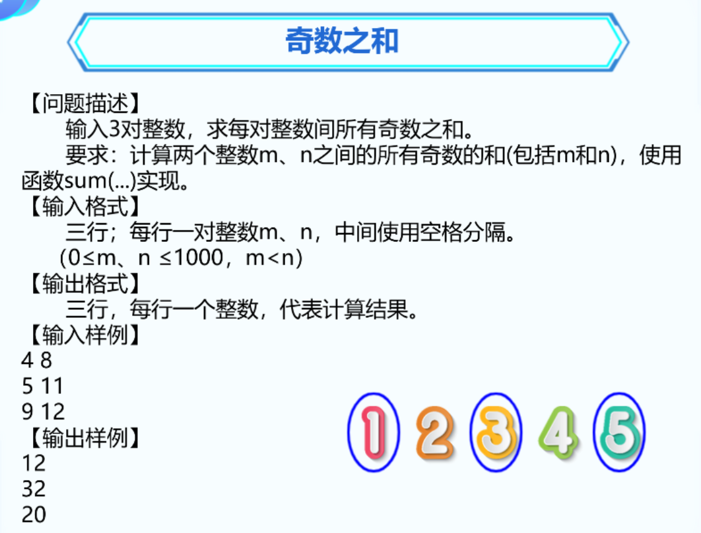
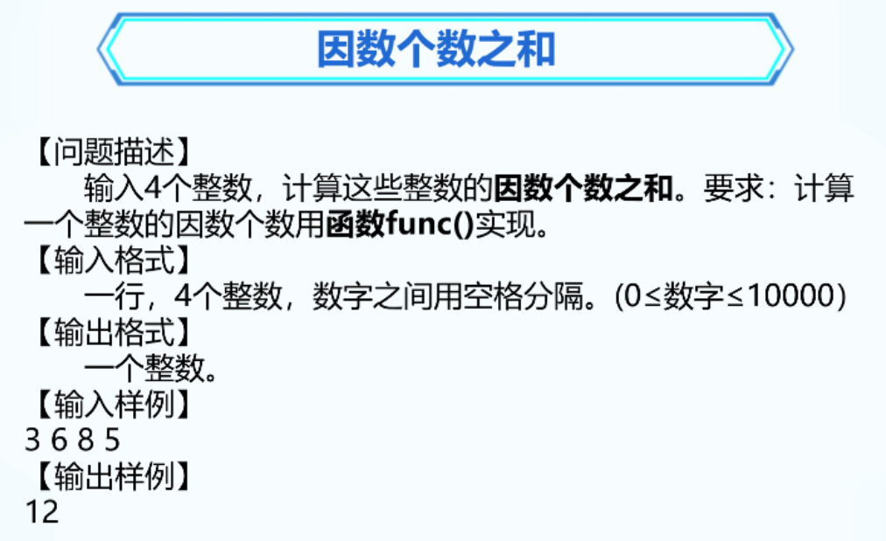
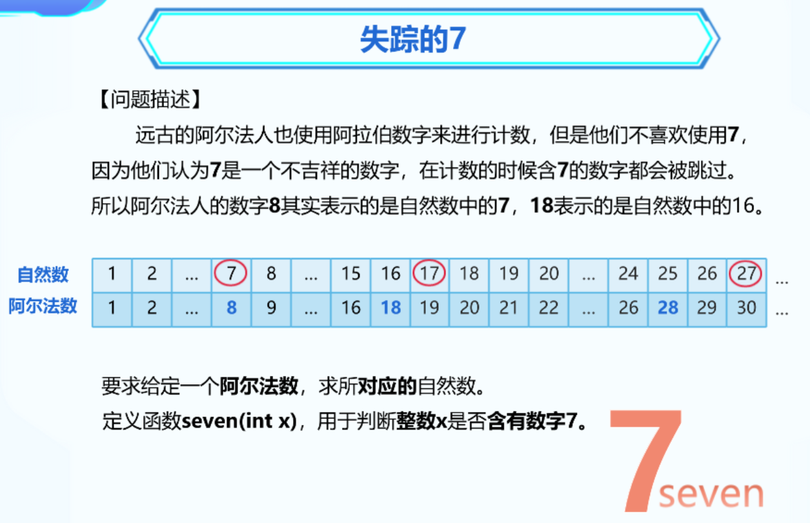
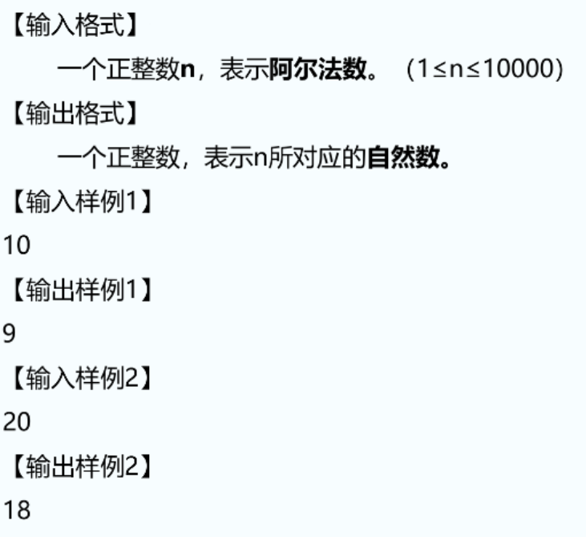

### 1. 简易计算器



```C++
#include <bits/stdc++.h>
using namespace std;

int calcu(int a, char sign, int b) {
	if (sign == '+')
	{
		return a + b;
	}
	if (sign == '-')
	{
		return a - b;
	}
	if (sign == '*')
	{
		return a * b;
	}
	if (sign == '/')
	{
		return a / b;
	}
}


int main() {
	int a, b;
	char sign;
	cin >> a >> sign >> b;
	cout << calcu(a, sign, b);
	return 0;
}
```

### 2. 奇数之和



```C++
#include <bits/stdc++.h>
using namespace std;

int sum(int a, int b) {
	int total = 0;
	for (int i = a; i <= b; i++)
	{
		if (i % 2 == 1)
		{
			total += i;
		}
	}
	return total;
}

int main() {
	int a, b, list[3];
	for (int i = 0; i < 3; i++)
	{
		cin >> a >> b;
		list[i] = sum(a, b);
	}
	/*for (int num : list)
	{
		cout << num << endl;
	}*/
	for (int i = 0; i < 3; i++)
	{
		cout << list[i] << endl;
	}


	return 0;
}
```


### 3. 因数个数之和



```C++
#include <bits/stdc++.h>
using namespace std;

int fun1(int a) {
	int total = 0;
	for (int i = 1; i <= a; i++)
	{
		if (a % i == 0)
		{
			total++;
		}
	}
	return total;
}

int main() {
	int a, b, c, d;
	cin >> a >> b >> c >> d;
	cout << fun1(a) + fun1(b) + fun1(c) + fun1(d);
	return 0;
}
```


### 4. 失踪的7





```C++
#include <bits/stdc++.h>
using namespace std;

bool seven(int x) {
	bool flag = false;
	while (x != 0) {
		if (x % 10 == 7)
		{
			flag = true;
			break;
		}
		x /= 10;
	}
	return flag;
}

int main() {
	int n, total = 0;
	cin >> n;
	for (int i = 1; i <= n; i++)
	{
		if (seven(i))
		{

			total++;
		}
	}
	cout << n - total;
	return 0;
}
```

