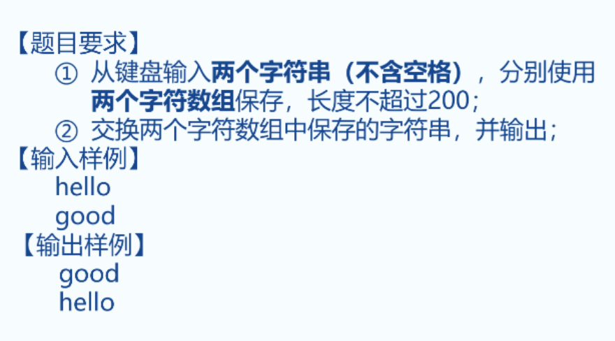
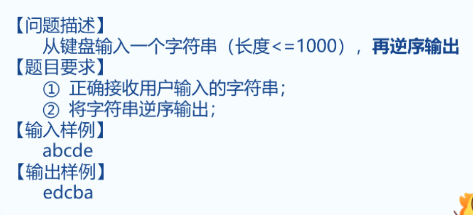
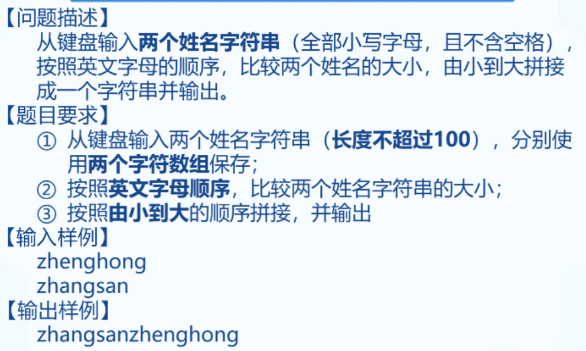
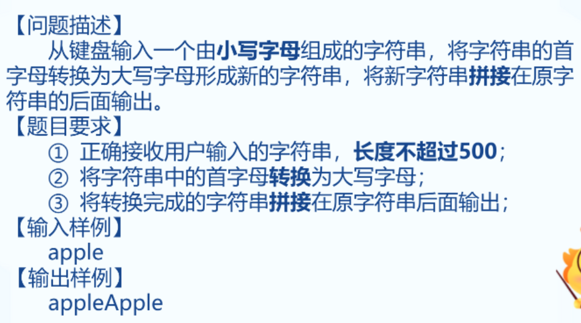
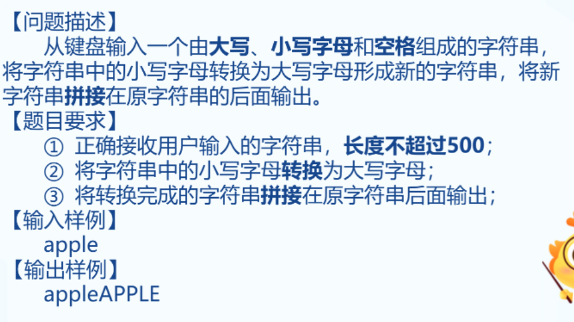
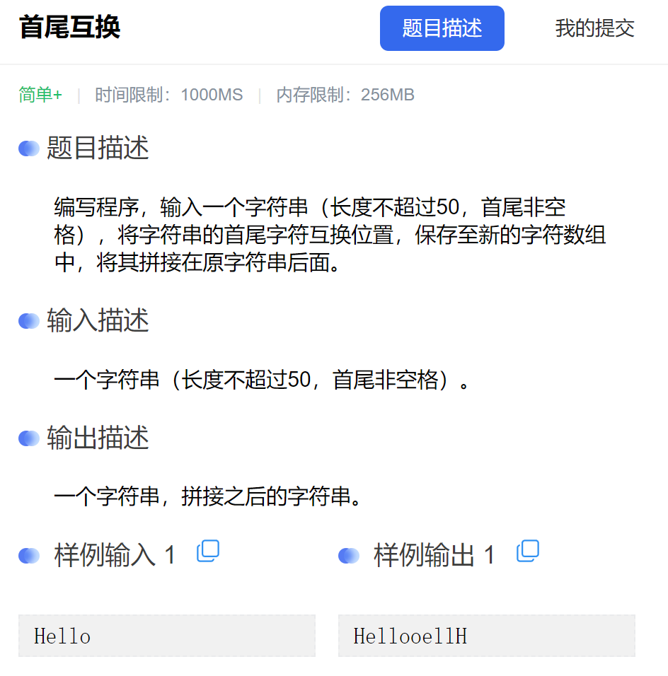

### 1. 交换字符串



```C++
#include <bits/stdc++.h>
using namespace std;


int main() {
	char s1[201] = { 0 };
	char s2[201] = { 0 };
	char temp[201] = { 0 };
	cin >> s1 >> s2;

	strcpy_s(temp, s1);  // temp = a;
	strcpy_s(s1, s2);       // a = b;
	strcpy_s(s2, temp);  // b = temp;

	cout << s1 << endl << s2;

	return 0;
}
```


### 2. 字符串的逆序



```C++
#include <bits/stdc++.h>
using namespace std;


int main() {
	char s1[1000] = { 0 };
	cin.getline(s1, 1001);


	for (int i = strlen(s1) - 1; i >= 0; i--)
	{
		cout << s1[i];
	}

	return 0;
}
```


### 3. 拼接姓名



```C++
#include <bits/stdc++.h>
using namespace std;


int main() {
	char name1[201] = { 0 };
	char name2[201] = { 0 };
	cin >> name1 >> name2;
	if (strcmp(name1, name2) > 0)
	{
		strcat_s(name2, name1);
		cout << name2;
	}
	else {
		strcat_s(name1, name2);
		cout << name1;
	}


	return 0;
}
```


### 4. 拼接字符串



```C++
#include <bits/stdc++.h>
using namespace std;


int main() {
	
	char s1[501] = { 0 };
	char s2[501] = { 0 };
	cin >> s1;
	strcpy_s(s2, s1);
	s2[0] -= 32;
	strcat_s(s1, s2);
	cout << s1;
	return 0;
}
```


### 5.  小写字母转换为大写字母



```C++
#include <bits/stdc++.h>
using namespace std;


int main() {
	
	char s1[500] = { 0 };
	char s2[500] = { 0 };
	cin.getline(s1, 501);
	strcpy_s(s2, s1);
	// 这里进行判断
	for (int i = 0; i < strlen(s2); i++)
	{
		// s2[i] -= 32; // 错误的
		if (s2[i] >= 'a' && s2[i] <= 'z')
		{
			s2[i] -= 32;
		}
	}
	strcat_s(s1, s2);
	cout << s1;
	return 0;
}
```


### 6. 首尾互换



```C ++
#include <bits/stdc++.h>
using namespace std;


int main() {
	
	char s1[50] = { 0 };
	char s2[50] = { 0 };
	char temp;
	cin.getline(s1, 51);
	strcpy_s(s2, s1);
	temp = s2[0];
	s2[0] = s2[strlen(s2) - 1];
	s2[strlen(s2) - 1] = temp;
	strcat_s(s1, s2);
	cout << s1;
	
	return 0;
}
```

