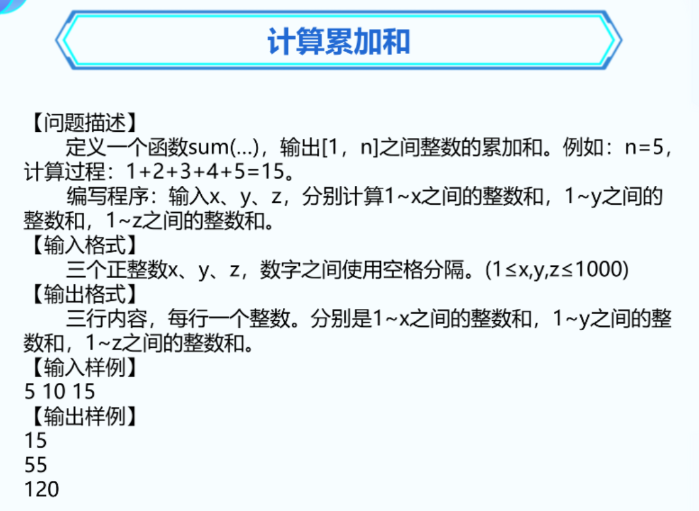
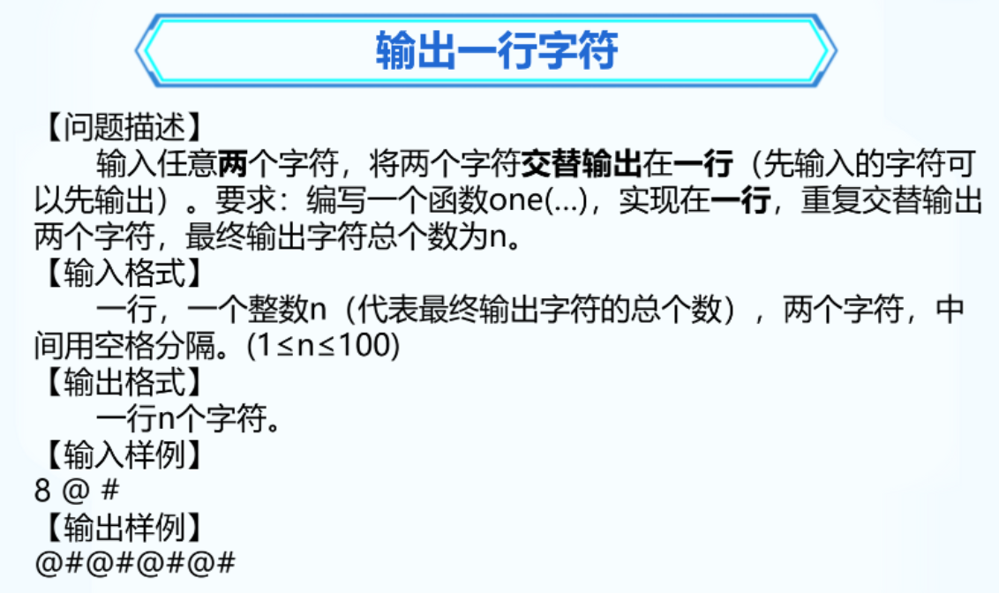
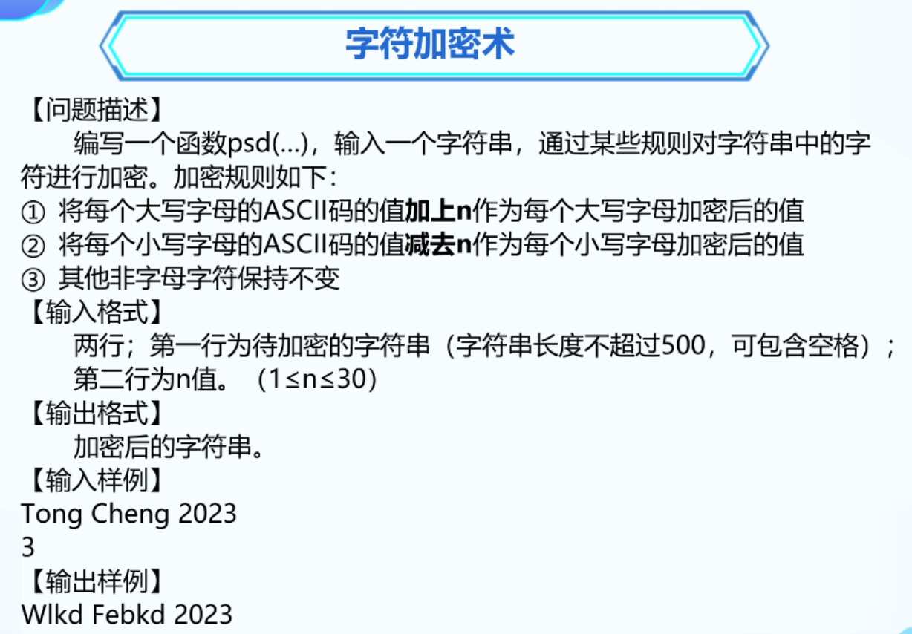

### 1. 计算累加和



```C++
#include <bits/stdc++.h>
using namespace std;

void sum(int s) {
	int total = 0;
	for (int i = 1; i <= s; i++)
	{
		total += i;
	}
	cout << total << endl;
}


int main() {
	int x, y, z;
	cin >> x >> y >> z;
	sum(x);
	sum(y);
	sum(z);

	return 0;
}
```


### 2. 找到指定字符出现的次数


```C++
#include <bits/stdc++.h>
using namespace std;

void stats(string s, char a) {
	int total = 0;
	for (char letter : s)
	{
		if (letter == a)
		{
			total++;
		}
	}
	cout << total;
}


int main() {
	string s;
	getline(cin, s);
	char a;
	cin >> a;
	stats(s, a);

	return 0;
}
```


### 3.输出一行字符



```C++
#include <bits/stdc++.h>
using namespace std;

void one(int n, char a, char b) {
	for (int i = 0; i < n; i++)
	{
		if (i % 2)
		{
			cout << b;
		}
		else {
			cout << a;
		}
	}
}


int main() {
	int n;
	char a, b;
	cin >> n >> a >> b;
	one(n, a, b);
}
```


### 4. 字符加密术



```C++
#include <bits/stdc++.h>
using namespace std;

void psd(string s, int n) {
	for (char letter : s)
	{
		if (letter >= 'A' && letter <= 'Z')
		{
			letter += 3;
			cout << (char)letter;
		}
		else if (letter >= 'a' && letter <= 'z') {
			letter -= 3;
			cout << (char)letter;
		}
		else {
			cout << letter;
		}
	}
}


int main() {
	string s;
	getline(cin, s);
	int n;
	cin >> n;
	psd(s, n);
	return 0;
}
```

