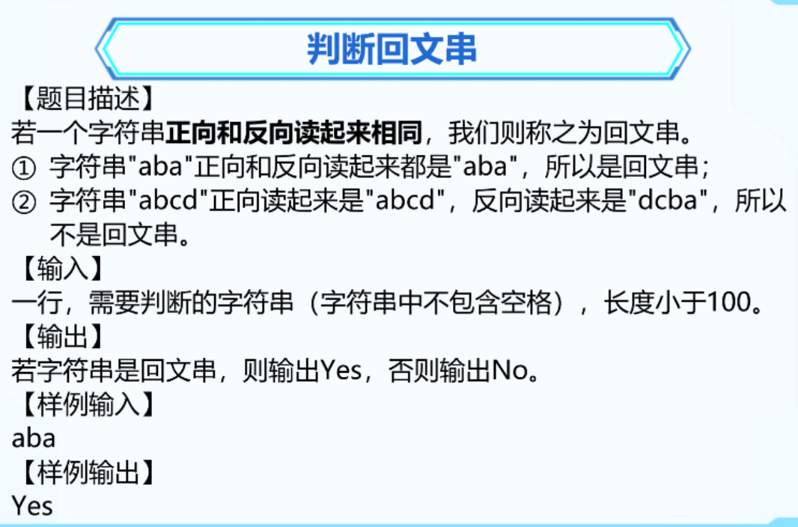

### 1. 字符串重组


```C++
#include <bits/stdc++.h>
using namespace std;

int main() {

	string s1, s2;
	getline(cin, s1);
	getline(cin, s2);
	int a = s1.length() / 2;

	for (int i = 0; i < a; i++)
	{
		cout << s1[i];
	}
	cout << s2;
	for (int i = a; i < s1.length(); i++)
	{
		cout << s1[i];
	}

	return 0;
}
```


### 2. 字符串判等


```C++
#include <bits/stdc++.h>
using namespace std;

int main() {
	
	string s1, s2;
	getline(cin, s1);
	getline(cin, s2);
	string a, b;
	for (int i = 0; i < s1.length(); i++)
		if (s1[i] != ' ') a += s1[i];

	for (int i = 0; i < s2.length(); i++)
		if (s2[i] != ' ') b += s2[i];

	if (a == b) cout << "yes";
	else cout << "no";
	return 0;
}
```


### 3. 回文串



```C++
#include <bits/stdc++.h>
using namespace std;

int main() {
	
	string s1;
	bool flag = true; // 是回文数
	getline(cin, s1);
	
	for (int i = 0; i < s1.length() / 2; i++)
	{
		if (s1[i] != s1[s1.length() - 1 - i])
		{
			flag = false;
		}
	}
	if (flag) cout << "yes";
	else cout << "no";
		
	return 0;
}
```


### 4. 词组缩写


```C++
#include <bits/stdc++.h>
using namespace std;

int main() {
	
	string s1, s2;
	getline(cin, s1);
	s2 += s1[0];
	for (int i = 1; i < s1.length(); i++)
	{
		if (s1[i] == ' ')
		{
			s2 += s1[i + 1];
		}
	}
	for (int i = 0; i < s2.length(); i++)
	{
		if (s2[i] >= 'a' && s2[i] <= 'z')
		{
			cout << (char)(s2[i] - 32);
		}
		else {
			cout << (char)s2[i];
		}
	}
	
	
	return 0;
}
```


### 5. 凯撒加密术


```C++
#include <bits/stdc++.h>
using namespace std;

int main() {
	
	string s1;
	getline(cin, s1);
	for (int i = 0; i < s1.length(); i++)
	{
		if (s1[i] == 'z')
		{
			cout << 'a';
		}
		else {
			cout << (char)(s1[i] + 1);
		}
	}
	return 0;
}
```


### 6. 统计大写字母个数


```C++
#include <bits/stdc++.h>
using namespace std;

int main() {
	
	string s;
	int sum = 0;
	getline(cin, s);
	for (int i = 0; i < s.length(); i++)
	{
		if (s[i] >= 'A' && s[i] <= 'Z')
		{
			sum++;
		}
	}
	cout << sum;
	return 0;
}
```

### 7. 连续出现的字符


```C++
#include <bits/stdc++.h>
using namespace std;

int main() {
	int n;  // 出现几次
	string s;  // 字符串
	cin >> n;
	cin.ignore();
	getline(cin, s);
	for (int i = 0; i < s.length() - n; i++)
	{
		bool flag = true;
		for (int j = i; j < i + n; j++)
		{
			if (s[i] != s[j])
			{
				flag = false;
				break;
			}
		}
		if (flag)
		{
			cout << s[i];
			break;
		}
	}
	

	return 0;
}
```

